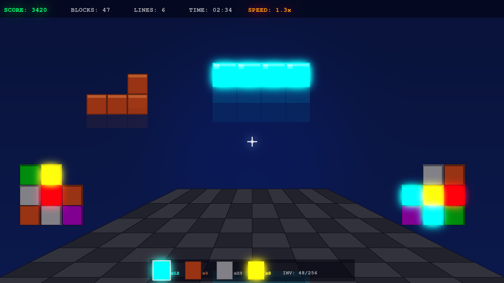

<div align="center">

<br>

# ⛏️ &nbsp; MineCtris &nbsp; 🟦

<br>

### You're inside the Tetris board now.

*Pieces are falling. Around you. On you.*

<br>

[](https://lx-0.github.io/mineCtris)

<br>

---

<br>

```
      🟦
   🟦 🟦       ← that's coming down
      🟦

         YOU ARE HERE  ↓

⬛ ⬛ ⬛ ⬛ ⬛ ⬛ ⬛ ⬛
🟫 ⬛ 🟫 🟫 ⬛ 🟫 🟫 ⬛   ← mine these
🟫 🟫 🟫 🟫 🟫 🟫 🟫 🟫   ← this row clears
```

<br>

</div>

---

<div align="center">



</div>

---

**MineCtris** drops you onto the floor of a Tetris board — first-person, fully 3D. Tetrominoes fall from above. They stack into walls around you. They pile up. They close in.

Your pickaxe is the only thing keeping you alive.

<br>

<div align="center">

| <kbd>W</kbd> <kbd>A</kbd> <kbd>S</kbd> <kbd>D</kbd> | <kbd>Space</kbd> | <kbd>Mouse</kbd> | <kbd>Click</kbd> |
|:---:|:---:|:---:|:---:|
| Move | Jump | Look | Mine |

</div>

<br>

Break blocks. Collect them. Fill a complete layer — it vanishes in a cascade of light and points. Leave a layer incomplete and it just... stays. And the next piece falls on top.

And the next.

And the next.

<br>

---

<div align="center">

*Random. Chaotic. Beautiful.*

*And merciless.*

<br>

[](https://lx-0.github.io/mineCtris)

<br>

<sub>Built with Three.js &nbsp;·&nbsp; Tone.js &nbsp;·&nbsp; Pure browser JS &nbsp;·&nbsp; <a href="LICENSE">MIT</a></sub>

<br>

</div>
